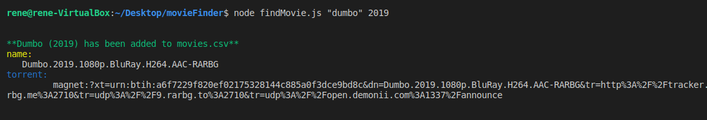

<!-- PROJECT LOGO -->
<br />
<p align="center">
  <h3 align="center">Find A Movie</h3>

  <p align="center">
    An awesome script to get movies easily
    <br />
    <a href="https://github.com/rene415/movieFinder"><strong>Explore the docs »</strong></a>
    <br />
  </p>
</p>


<!--TABLE OF CONTENTS-->
## Table of Contents

* [About the Project](#about-the-project)
  * [Built With](#built-with)
* [Getting Started](#getting-started)
  * [Prerequisites](#prerequisites)
  * [Installation](#installation)
* [Usage](#usage)
* [Contact](#contact)


<!-- ABOUT THE PROJECT -->
## About The Project
<div align="center">
  
</div>
This is a script to help you get magnet links to your favorite movie!

Here is how it works: 
* Step 1: Find the movie you wish to get with the date it was released
* Step 2: in terminal/command prompt type the movie name with the year
* Step 3: Get your download link saved to a file called movies.csv

I have been working on this script fro 2 days not all bugs are fixed

### Built With
The following project was created with:
* [Node JS](https://nodejs.org)

<!-- GETTING STARTED -->
## Getting Started

If you know a little bit of programing, cool you are already ahead of the game. 

### Prerequisites

In order to begin working on this project you need to install all of the [Builtwith](#built-with) frameworks

Installing NodeJs on: [Windows](https://www.youtube.com/watch?v=gHuIKptS0Qg), [Linux](https://www.youtube.com/watch?v=K6QiSKy2zoM&), [Mac](https://www.youtube.com/watch?v=rF1ZHmqvm8I)

(Not required but if you are interested in downloading) Installing Git for: [Windows](https://www.youtube.com/watch?v=J_Clau1bYco), [Linux](https://www.youtube.com/watch?v=ZMgLZUYd8Cw), [Mac](https://www.youtube.com/watch?v=LK0vMt_lEbQ)

### Installation
0. Open [Terminal](https://youtu.be/QROX039ckO8?t=25)```, or ```[CMD](https://www.howtogeek.com/235101/10-ways-to-open-the-command-prompt-in-windows-10/)
1. Clone the Repo
```git clone https://github.com/rene415/movieFinder```
or download the zip file from [HERE](https://github.com/rene415/movieFinder/archive/master.zip)

2. Rember where you saved the folder so you can access it. Now go into the folder, ```cd movieFinder```

3. Install all the node modules
```sh
npm install npm@latest
```
3. Install NPM packages
```sh
npm install
```
<!-- Usage -->
## Usage

How to use this program?

Simple: once inside the folder and all installation is complete enter the followig

```sh
node findMovie.js "Name_of_movie" year_movie_released
```
return should be
```sh
**Name_of_movie (year_movie_released) has been added to movies.csv**
name:
   Name.of.movie.(year_movie_released).1080p.BluRay.H264.AAC-RARBG
torrent:
         magnet:?xt=urn:btih:238ef9e616dceeec893d4ff3b2a52a32a83c5db7&dn=Name.of.movie.(year_movie_released).1080p.BluRay.H264.AAC-RARBG&tr=http%3A%2F%2Ftracker.trackerfix.com%3A80%2Fannounce&tr=udp%3A%2F%2F9.rarbg.me%3A2710&tr=udp%3A%2F%2F9.rarbg.to%3A2710&tr=udp%3A%2F%2Fopen.demonii.com%3A1337%2Fannounce
```

Example

```sh
node findMovie.js "Dumbo" 2019
```

return should be

```sh
**Dumbo (2019) has been added to movies.csv**
name:
   Dumbo.2019.1080p.BluRay.H264.AAC-RARBG
torrent:
         magnet:?xt=urn:btih:a6f7229f820ef02175328144c885a0f3dce9bd8c&dn=Dumbo.2019.1080p.BluRay.H264.AAC-RARBG&tr=http%3A%2F%2Ftracker.trackerfix.com%3A80%2Fannounce&tr=udp%3A%2F%2F9.ra
rbg.me%3A2710&tr=udp%3A%2F%2F9.rarbg.to%3A2710&tr=udp%3A%2F%2Fopen.demonii.com%3A1337%2Fannounce
```

You will find all movies in a file called movies.csv
<!-- Contribute -->
## Contributing

Contributions are what make the open source community such an amazing place to be learn, inspire, and create. Any contributions you make are **greatly appreciated**.

1. Fork the Project
2. Create your Feature Branch (`git checkout -b feature/AmazingFeature`)
3. Commit your Changes (`git commit -m 'Add some AmazingFeature`)
4. Push to the Branch (`git push origin feature/AmazingFeature`)
5. Open a Pull Request


<!-- LICENSE --
## License

Distributed under the MIT License. See `LICENSE` for more information.


<!-- CONTACT -->
## Contact

Rene Ramirez - [@ReneMotivator](https://twitter.com/ReneMotivator)

Project Link: [movieFinder](https://github.com/rene415/movieFinder)


<!-- ACKNOWLEDGEMENTS -->
## Acknowledgements
* [Best-README-template](https://github.com/othneildrew/Best-README-Template)
* [Choose an Open Source License](https://choosealicense.com)